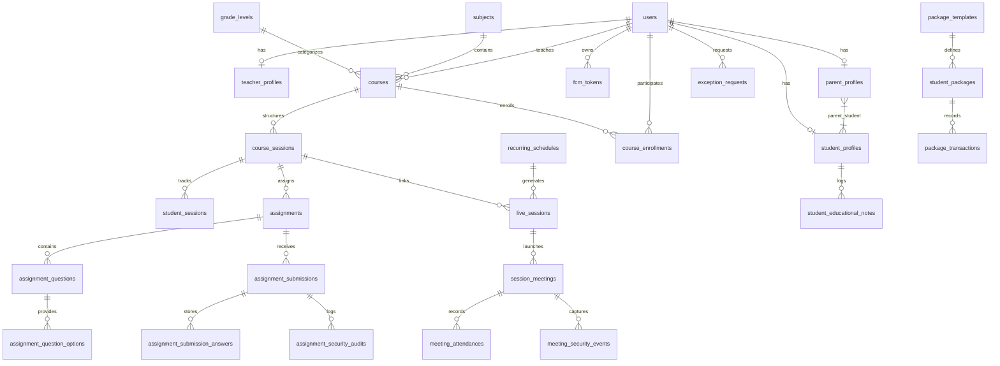
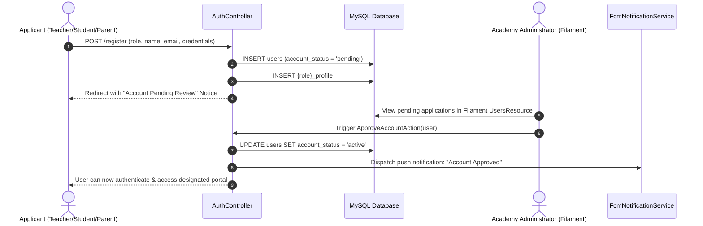
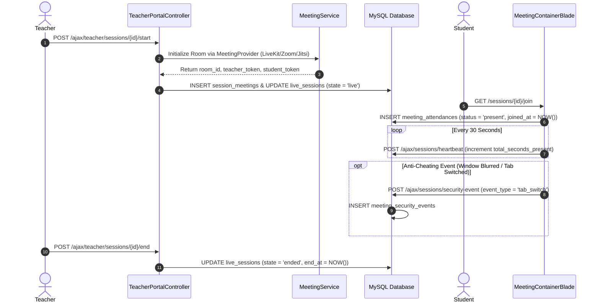
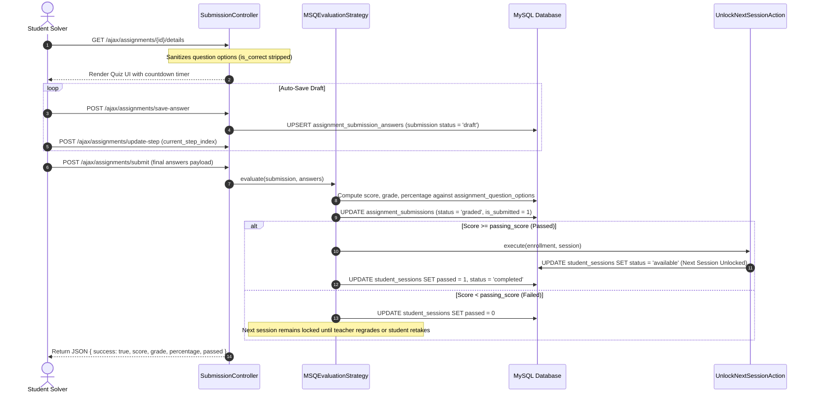
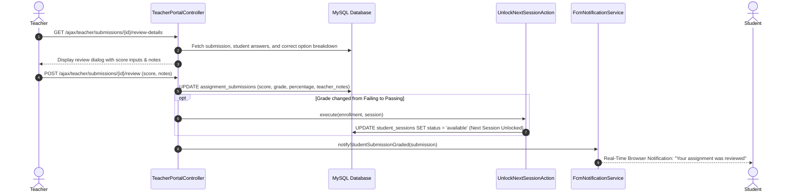
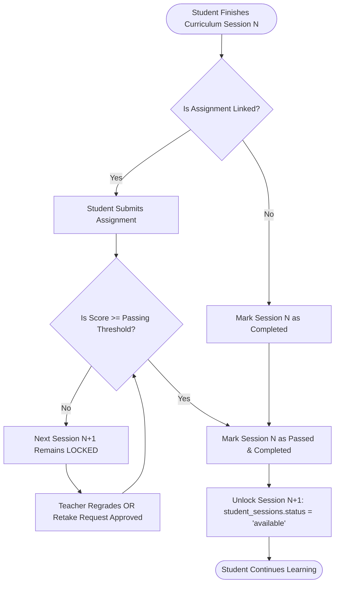
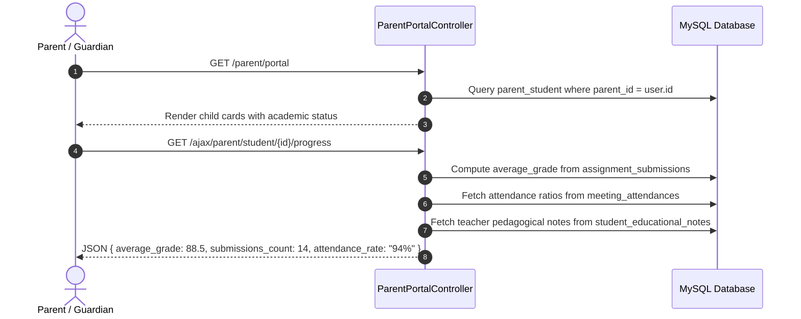
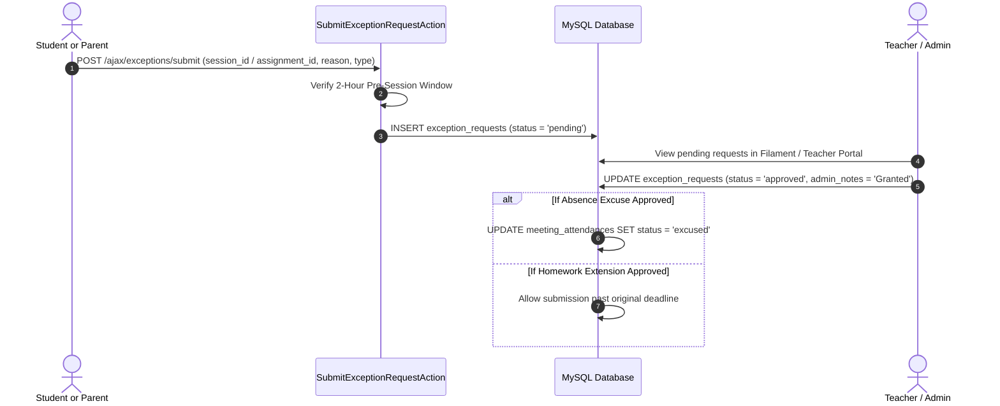
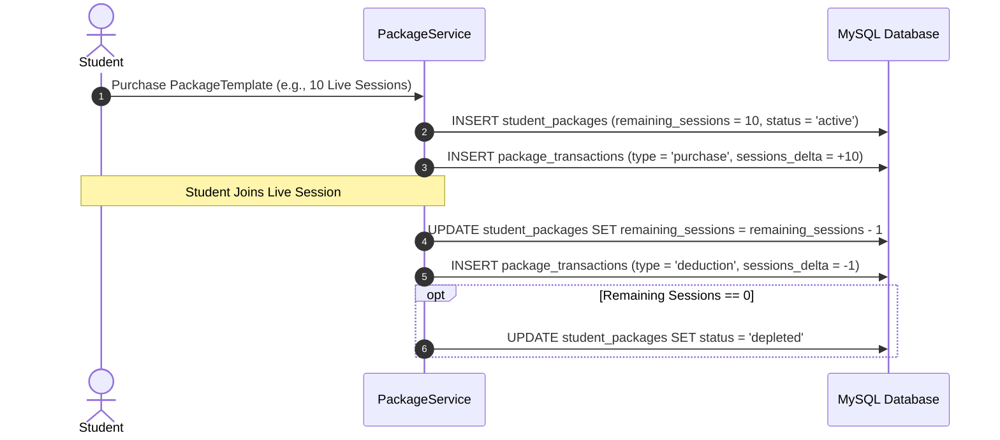

# Elite Academy - System Architecture, Database Design & Full-Cycle Manual

**Project Name:** Elite Academy (منصة أكاديمية النخبة التعليمية)  
**Framework:** Laravel 12/13 (PHP 8.4) + Filament v3 Admin Suite + Livewire v3 + Alpine.js  
**Database:** MySQL / MariaDB (UTF-8 MB4)  
**Security & Realtime:** Firebase Cloud Messaging (FCM), Token-Based Meeting Providers, CSRF & Anti-Cheating Browser Auditing  
**Documentation Version:** 2.0.0 (Production Master)

---

## Table of Contents
1. [Executive System Overview](#1-executive-system-overview)
2. [High-Level Architecture & Technical Stack](#2-high-level-architecture--technical-stack)
3. [Directory Layout & Codebase Structure](#3-directory-layout--codebase-structure)
4. [User Roles, Authentication & Policy Hierarchy](#4-user-roles-authentication--policy-hierarchy)
5. [Complete Database Design & Entity Relationships](#5-complete-database-design--entity-relationships)
   - [5.1 Identity & Access Management (IAM)](#51-identity--access-management-iam)
   - [5.2 Academics, Courses & Curriculum](#52-academics-courses--curriculum)
   - [5.3 Live Sessions, Teleconferencing & Attendance](#53-live-sessions-teleconferencing--attendance)
   - [5.4 Assignments, MSQ Exam Engine & Grading](#54-assignments-msq-exam-engine--grading)
   - [5.5 Pedagogical Profile & Educational Notes](#55-pedagogical-profile--educational-notes)
   - [5.6 Packages, Credits & Financial Accounting](#56-packages-credits--financial-accounting)
   - [5.7 Content Management System & Landing Page Builder](#57-content-management-system--landing-page-builder)
   - [5.8 Dynamic Localization & Translation System](#58-dynamic-localization--translation-system)
   - [5.9 Database Indexes & Performance Optimizations](#59-database-indexes--performance-optimizations)
6. [Core Service & Domain Action Pipelines](#6-core-service--domain-action-pipelines)
7. [Full Lifecycle Workflows (End-to-End Execution Flows)](#7-full-lifecycle-workflows-end-to-end-execution-flows)
   - [Cycle 1: User Onboarding & Approval](#cycle-1-user-onboarding--approval)
   - [Cycle 2: Course Enrollment & Curriculum Tree Provisioning](#cycle-2-course-enrollment--curriculum-tree-provisioning)
   - [Cycle 3: Live Classroom Lifecycle, WebRTC/Telemetry & Attendance](#cycle-3-live-classroom-lifecycle-webrtctelemetry--attendance)
   - [Cycle 4: Assignment, Homework & MSQ Examination Cycle](#cycle-4-assignment-homework--msq-examination-cycle)
   - [Cycle 5: Teacher Pedagogical Review, Regrading & Feedback](#cycle-5-teacher-pedagogical-review-regrading--feedback)
   - [Cycle 6: Sequential Curriculum Unlocking](#cycle-6-sequential-curriculum-unlocking)
   - [Cycle 7: Parent Portal Monitoring & Engagement](#cycle-7-parent-portal-monitoring--engagement)
   - [Cycle 8: Absence Excuses & Homework Extension Exception Cycle](#cycle-8-absence-excuses--homework-extension-exception-cycle)
   - [Cycle 9: Student Package Consumption & Credit Balances](#cycle-9-student-package-consumption--credit-balances)
8. [Anti-Cheating & Telemetry Security Architecture](#8-anti-cheating--telemetry-security-architecture)
9. [Verification, Testing & Zero-Error Standards](#9-verification-testing--zero-error-standards)

---

# 1. Executive System Overview

Elite Academy is an enterprise-grade EdTech platform designed for hybrid synchronous and asynchronous learning. It integrates:
- **Central Administrative Governance (Filament v3 Admin Panel)** for managing curricula, staff, revenue packages, dynamic landing pages, and global translation dictionaries.
- **Dedicated Teacher Portal**: Real-time session management, attendance tracking with one-touch cohort toggles, assignment creation, student academic profiles with 8-tab drilldowns, and manual grading overrides.
- **Student Portal**: Interactive MSQ quiz engine, sequential session unlocking, upcoming class countdowns, recorded lesson access, package balance cards, and automated absence/exception requests.
- **Parent Portal**: Multi-child association, real-time GPA/average grade monitoring, submission reviews, attendance analytics, and direct absence excuse submission.
- **WebRTC/Teleconferencing Infrastructure**: Vendor-agnostic meeting provider abstraction (LiveKit, Zoom, Jitsi, Google Meet, Microsoft Teams) with active telemetry, heartbeat monitors, and anti-cheating window focus tracking.

---

# 2. High-Level Architecture & Technical Stack

```mermaid
graph TD
    Client[Web & Mobile Browsers / Progressive Client] --> Gateway[Reverse Proxy / Nginx / Laragon / Apache]
    Gateway --> LaravelKernel[Laravel 13 Application Kernel / HTTP Middleware]

    subgraph Presentation & Portals
        FilamentPanel[Filament v3 Admin Panel]
        TeacherPortal[Teacher Blade + AJAX Portal]
        StudentPortal[Student Portal & Exam Engine]
        ParentPortal[Parent Dashboard]
        PublicSite[Landing Page & Course Catalog]
    end

    LaravelKernel --> Presentation & Portals

    subgraph Domain Action & Service Layer
        ActionPipeline[Single-Responsibility Actions: Grade, Unlock, Approve, Excuse]
        EvalEngine[MSQ Auto-Evaluation Strategy Engine]
        SessionService[Live Session & Recurring Scheduler]
        MeetingService[Multi-Provider Meeting Bridge]
        SecurityTelemetry[Anti-Cheating & Audit Logger]
        NotificationService[Firebase Cloud Messaging FCM Push]
    end

    Presentation & Portals --> Domain Action & Service Layer

    subgraph Data & Storage Layer
        EloquentModels[Eloquent ORM Models with Strict Types]
        MySQL[(MySQL 8.0 / MariaDB InnoDB)]
        Cache[(Redis / Database Cache & Session Store)]
        DiskStorage[Windows / Linux Safe Filesystem Storage]
    end

    Domain Action & Service Layer --> Data & Storage Layer
```

### Technology Matrix
- **PHP Version:** 8.4.5 (configured for strict types and modern language features).
- **Backend Framework:** Laravel 13.x with Livewire 3 and Spatie Permissions.
- **Admin Panel:** Filament PHP v3 with custom actions, widgets, and form schemas.
- **Frontend Stack:** Modern Vanilla CSS + Tailwind CSS utilities, Alpine.js for lightweight interactions, and custom fluid spring-physics modal engines.
- **Asynchronous Execution:** Laravel Queue Worker & Scheduler (`schedule:run`).
- **Push Notifications:** Firebase Cloud Messaging (FCM v1 HTTP API).

---

# 3. Directory Layout & Codebase Structure

```text
elite-academy/
├── app/
│   ├── Actions/                          # Single Responsibility Domain Actions
│   │   ├── Course/UnlockNextSessionAction.php
│   │   ├── Session/SubmitExceptionRequestAction.php
│   │   ├── Submission/GradeSubmissionAction.php
│   │   └── User/ApproveAccountAction.php
│   ├── Enums/                            # Domain Value Objects & Enums
│   │   ├── AccountStatus.php             # pending, active, suspended, rejected
│   │   ├── CourseStatus.php              # draft, published, archived
│   │   ├── LiveSessionState.php          # scheduled, live, ended, cancelled
│   │   ├── MeetingAttendanceStatus.php   # present, late, absent, excused
│   │   ├── MeetingProviderSlug.php       # livekit, zoom, jitsi, google_meet, teams
│   │   ├── MeetingSecurityEventType.php  # window_blur, tab_switch, fullscreen_exit
│   │   ├── PackageTransactionType.php    # purchase, deduction, refund, adjustment
│   │   ├── PaymentStatus.php             # unpaid, pending, completed, refunded
│   │   ├── Role.php                      # super_admin, admin, teacher, student, parent
│   │   ├── SessionProgressStatus.php     # locked, available, completed
│   │   └── SubmissionStatus.php          # draft, submitted, graded, rejected
│   ├── Filament/                         # Filament v3 Administration Architecture
│   │   ├── Pages/                        # Custom Admin Dashboards & Reports
│   │   ├── Resources/                    # 20 Resource Controllers & CRUD Schemas
│   │   └── Widgets/                      # KPI metric widgets, charts & roster cards
│   ├── Http/
│   │   ├── Controllers/                  # Web, API & AJAX Controllers
│   │   │   ├── Auth/                     # Registration, Login, Social Auth
│   │   │   ├── Meeting/                  # WebRTC join, leave, heartbeat, telemetry
│   │   │   ├── Notification/             # Push tokens & unread badge counters
│   │   │   ├── Parent/                   # Child linking & academic progress APIs
│   │   │   ├── Student/                  # Session details, curriculum progression
│   │   │   ├── Submission/               # Exam draft auto-save & final submit
│   │   │   └── Teacher/                  # 8-tab profile, roster, regrading, overrides
│   │   ├── Middleware/                   # Auth, role check, localized routing
│   │   └── Requests/                     # Form request validation pipelines
│   ├── Models/                           # 48 Eloquent Models
│   ├── Policies/                         # Resource authorization policies
│   ├── Providers/                        # Application service providers
│   └── Services/                         # Complex Business Services
│       ├── Assignment/Strategies/        # Evaluation strategies (MSQ, Manual)
│       ├── LandingPageEngineService.php  # Dynamic CMS block compiler
│       ├── Meeting/                      # Meeting provider drivers
│       ├── Notification/                 # FCM push delivery engine
│       ├── Security/                     # Telemetry & security audit logging
│       ├── Session/                      # Session lifecycle & recurrence engines
│       └── Translation/                  # Dynamic database translation driver
├── config/                               # Core Laravel configuration files
├── database/
│   ├── migrations/                       # 48 Database schema migrations
│   └── seeders/                          # Master test seeders & demo data
├── resources/
│   ├── views/
│   │   ├── components/                   # Reusable Blade UI components
│   │   ├── layouts/                      # App, Portal & Panel Shells
│   │   ├── pages/                        # Teacher, Student, Parent & Exam pages
│   │   └── partials/                     # Modals, toasts, real-time push widgets
├── routes/
│   ├── web.php                           # Web endpoints, Portals & AJAX routes
│   └── console.php                       # Artisan console jobs & schedules
└── tests/
    └── Feature/                          # End-to-end integration test suites
```

---

# 4. User Roles, Authentication & Policy Hierarchy

The platform implements strict Role-Based Access Control (RBAC):

```text
[User Model: users]
      │
      ├── role = 'super_admin' / 'admin' ──► Full Filament Panel (/admin)
      │
      ├── role = 'teacher' ────────────────► Teacher Portal (/teacher/portal)
      │                                      Can manage assigned courses, sessions, rosters,
      │                                      assignments, grading overrides, and student notes.
      │
      ├── role = 'student' ────────────────► Student Portal (/student/portal) & Exam Solver
      │                                      Can access enrolled courses, live lessons,
      │                                      solve quizzes, request extensions/excuses.
      │
      └── role = 'parent' ─────────────────► Parent Portal (/parent/portal)
                                             Can link children via secure verification code,
                                             view real-time report cards, and submit absence notes.
```

### Security Policies
- **`StudentProfilePolicy`**: Enforces that Teachers can view/edit profile details only for students actively enrolled in their courses or live sessions. Admins have unrestricted access. Parents can only access their linked children.
- **`AssignmentSubmissionPolicy`**: Students can only view or update their own submissions. Teachers can only grade submissions for assignments belonging to their courses.

---

# 5. Complete Database Design & Entity Relationships

The database consists of **48 migrations** and **48 Eloquent models**, engineered in 3NF with cascading constraints and high-speed composite indexing.



---

## 5.1 Identity & Access Management (IAM)

### `users`
Core authentication and user account table.
- `id`: BIGINT UNSIGNED (Primary Key)
- `name`: VARCHAR(255)
- `email`: VARCHAR(255) (Unique)
- `phone`: VARCHAR(50) (Nullable, Indexed)
- `role`: ENUM (`super_admin`, `admin`, `teacher`, `student`, `parent`)
- `account_status`: ENUM (`pending`, `active`, `suspended`, `rejected`) - Default: `pending`
- `email_verified_at`: TIMESTAMP (Nullable)
- `password`: VARCHAR(255)
- `avatar_url`: VARCHAR(1024) (Nullable)
- `preferred_locale`: VARCHAR(10) - Default: `ar`
- `remember_token`: VARCHAR(100) (Nullable)
- `created_at`, `updated_at`, `deleted_at`: TIMESTAMP (SoftDeletes)

### `teacher_profiles`
Pedagogical attributes, credentials, and subjects taught.
- `id`: BIGINT UNSIGNED (Primary Key)
- `user_id`: BIGINT UNSIGNED (Foreign Key &rarr; `users.id` ON DELETE CASCADE, Unique)
- `bio`: TEXT (Nullable)
- `specialization`: VARCHAR(255) (Nullable)
- `qualifications`: JSON (Nullable)
- `hourly_rate`: DECIMAL(10,2) - Default: `0.00`
- `is_featured`: BOOLEAN - Default: `false`
- `created_at`, `updated_at`, `deleted_at`: TIMESTAMP

### `student_profiles`
Academic stage, guardian links, and student metadata.
- `id`: BIGINT UNSIGNED (Primary Key)
- `user_id`: BIGINT UNSIGNED (Foreign Key &rarr; `users.id` ON DELETE CASCADE, Unique)
- `grade_level_id`: BIGINT UNSIGNED (Foreign Key &rarr; `grade_levels.id` ON DELETE SET NULL, Nullable)
- `birthdate`: DATE (Nullable)
- `school_name`: VARCHAR(255) (Nullable)
- `guardian_phone`: VARCHAR(50) (Nullable)
- `linking_code`: VARCHAR(20) (Unique, Indexed) - Used by parents to claim student
- `created_at`, `updated_at`, `deleted_at`: TIMESTAMP

### `parent_profiles`
Guardian account metadata.
- `id`: BIGINT UNSIGNED (Primary Key)
- `user_id`: BIGINT UNSIGNED (Foreign Key &rarr; `users.id` ON DELETE CASCADE, Unique)
- `national_id`: VARCHAR(50) (Nullable)
- `relation_type`: ENUM (`father`, `mother`, `guardian`)
- `created_at`, `updated_at`, `deleted_at`: TIMESTAMP

### `parent_student` (Pivot)
Many-to-many relationship linking parents to children.
- `id`: BIGINT UNSIGNED (Primary Key)
- `parent_id`: BIGINT UNSIGNED (Foreign Key &rarr; `users.id` ON DELETE CASCADE)
- `student_id`: BIGINT UNSIGNED (Foreign Key &rarr; `users.id` ON DELETE CASCADE)
- `relationship`: VARCHAR(50) - Default: `parent`
- `is_primary`: BOOLEAN - Default: `true`
- `created_at`, `updated_at`: TIMESTAMP
- **Unique Constraint:** `(parent_id, student_id)`

### `fcm_tokens`
Device push notification tokens for mobile and desktop browsers.
- `id`: BIGINT UNSIGNED (Primary Key)
- `user_id`: BIGINT UNSIGNED (Foreign Key &rarr; `users.id` ON DELETE CASCADE)
- `token`: VARCHAR(500) (Indexed)
- `device_type`: VARCHAR(50) (Nullable - e.g., `web`, `android`, `ios`)
- `created_at`, `updated_at`: TIMESTAMP

---

## 5.2 Academics, Courses & Curriculum

### `grade_levels`
Educational tiers (e.g., Grade 10, Grade 11, Thanaweya Amma).
- `id`: BIGINT UNSIGNED (Primary Key)
- `name`: VARCHAR(255)
- `slug`: VARCHAR(255) (Unique)
- `order`: INT - Default: `0`
- `is_active`: BOOLEAN - Default: `true`
- `created_at`, `updated_at`, `deleted_at`: TIMESTAMP

### `subjects`
Academic subjects (e.g., Physics, Chemistry, Pure Mathematics).
- `id`: BIGINT UNSIGNED (Primary Key)
- `grade_level_id`: BIGINT UNSIGNED (Foreign Key &rarr; `grade_levels.id` ON DELETE CASCADE)
- `name`: VARCHAR(255)
- `slug`: VARCHAR(255) (Unique)
- `icon_url`: VARCHAR(1024) (Nullable)
- `courses_count`: INT - Default: `0`
- `teachers_count`: INT - Default: `0`
- `is_active`: BOOLEAN - Default: `true`
- `created_at`, `updated_at`, `deleted_at`: TIMESTAMP

### `courses`
Core curriculum courses.
- `id`: BIGINT UNSIGNED (Primary Key)
- `teacher_id`: BIGINT UNSIGNED (Foreign Key &rarr; `users.id` ON DELETE SET NULL, Nullable)
- `subject_id`: BIGINT UNSIGNED (Foreign Key &rarr; `subjects.id` ON DELETE CASCADE)
- `grade_level_id`: BIGINT UNSIGNED (Foreign Key &rarr; `grade_levels.id` ON DELETE CASCADE)
- `title`: VARCHAR(255)
- `slug`: VARCHAR(255) (Unique)
- `description`: TEXT (Nullable)
- `demo_video_url`: VARCHAR(1024) (Nullable)
- `price`: DECIMAL(10,2) - Default: `0.00`
- `status`: ENUM (`draft`, `published`, `archived`) - Default: `draft`
- `is_sequential`: BOOLEAN - Default: `true` (enforces session unlocking upon completion)
- `passing_grade`: DECIMAL(5,2) - Default: `70.00`
- `created_at`, `updated_at`, `deleted_at`: TIMESTAMP

### `course_sessions`
Sequential lessons / modules belonging to a course.
- `id`: BIGINT UNSIGNED (Primary Key)
- `course_id`: BIGINT UNSIGNED (Foreign Key &rarr; `courses.id` ON DELETE CASCADE)
- `order`: INT (Indexed) - Session sequence in curriculum
- `title`: VARCHAR(255)
- `description`: TEXT (Nullable)
- `video_url`: VARCHAR(1024) (Nullable)
- `duration_minutes`: INT - Default: `60`
- `is_free`: BOOLEAN - Default: `false`
- `start_date`: DATETIME (Nullable)
- `end_date`: DATETIME (Nullable)
- `created_at`, `updated_at`, `deleted_at`: TIMESTAMP

### `course_enrollments`
Student enrollment status and overall academic standing in a course.
- `id`: BIGINT UNSIGNED (Primary Key)
- `user_id`: BIGINT UNSIGNED (Foreign Key &rarr; `users.id` ON DELETE CASCADE)
- `course_id`: BIGINT UNSIGNED (Foreign Key &rarr; `courses.id` ON DELETE CASCADE)
- `enrolled_at`: TIMESTAMP
- `completed_at`: TIMESTAMP (Nullable)
- `status`: ENUM (`active`, `completed`, `dropped`) - Default: `active`
- `progress_percentage`: DECIMAL(5,2) - Default: `0.00`
- `created_at`, `updated_at`: TIMESTAMP
- **Unique Constraint:** `(user_id, course_id)`

### `student_sessions`
Curriculum progression, session lock state, and attendance sync for each student.
- `id`: BIGINT UNSIGNED (Primary Key)
- `student_id`: BIGINT UNSIGNED (Foreign Key &rarr; `users.id` ON DELETE CASCADE)
- `session_id`: BIGINT UNSIGNED (Foreign Key &rarr; `course_sessions.id` ON DELETE CASCADE)
- `status`: ENUM (`locked`, `available`, `completed`) - Default: `locked`
- `attendance_status`: ENUM (`absent`, `present`, `late`, `excused`) - Default: `absent`
- `passed`: BOOLEAN - Default: `false`
- `unlocked_at`: TIMESTAMP (Nullable)
- `completed_at`: TIMESTAMP (Nullable)
- `created_at`, `updated_at`: TIMESTAMP
- **Unique Constraint:** `(student_id, session_id)`

---

## 5.3 Live Sessions, Teleconferencing & Attendance

### `live_sessions`
Scheduled live lecture events (both one-time and recurring instances).
- `id`: BIGINT UNSIGNED (Primary Key)
- `course_id`: BIGINT UNSIGNED (Foreign Key &rarr; `courses.id` ON DELETE CASCADE, Nullable)
- `course_session_id`: BIGINT UNSIGNED (Foreign Key &rarr; `course_sessions.id` ON DELETE SET NULL, Nullable)
- `teacher_id`: BIGINT UNSIGNED (Foreign Key &rarr; `users.id` ON DELETE CASCADE)
- `recurring_schedule_id`: BIGINT UNSIGNED (Foreign Key &rarr; `recurring_schedules.id` ON DELETE SET NULL, Nullable)
- `title`: VARCHAR(255)
- `description`: TEXT (Nullable)
- `scheduled_at`: DATETIME
- `start_at`: DATETIME (Nullable)
- `end_at`: DATETIME (Nullable)
- `state`: ENUM (`scheduled`, `live`, `ended`, `cancelled`) - Default: `scheduled`
- `meeting_link`: VARCHAR(1024) (Nullable)
- `is_free_demo`: BOOLEAN - Default: `false`
- `capacity`: INT - Default: `100`
- `created_at`, `updated_at`, `deleted_at`: TIMESTAMP

### `recurring_schedules`
Automation templates for generating weekly recurring live sessions.
- `id`: BIGINT UNSIGNED (Primary Key)
- `course_id`: BIGINT UNSIGNED (Foreign Key &rarr; `courses.id` ON DELETE CASCADE)
- `teacher_id`: BIGINT UNSIGNED (Foreign Key &rarr; `users.id` ON DELETE CASCADE)
- `day_of_week`: TINYINT UNSIGNED (0 = Sunday ... 6 = Saturday)
- `start_time`: TIME
- `duration_minutes`: INT - Default: `90`
- `is_active`: BOOLEAN - Default: `true`
- `created_at`, `updated_at`: TIMESTAMP

### `meeting_providers`
Configured teleconferencing drivers (LiveKit, Zoom, Jitsi, Google Meet, Teams).
- `id`: BIGINT UNSIGNED (Primary Key)
- `name`: VARCHAR(255)
- `slug`: VARCHAR(50) (Unique) - ENUM (`livekit`, `zoom`, `jitsi`, `google_meet`, `teams`)
- `credentials`: JSON (Encrypted API keys, secrets, server URLs)
- `is_active`: BOOLEAN - Default: `true`
- `created_at`, `updated_at`: TIMESTAMP

### `session_meetings`
Active teleconferencing room instances launched for a live session.
- `id`: BIGINT UNSIGNED (Primary Key)
- `live_session_id`: BIGINT UNSIGNED (Foreign Key &rarr; `live_sessions.id` ON DELETE CASCADE)
- `meeting_provider_id`: BIGINT UNSIGNED (Foreign Key &rarr; `meeting_providers.id` ON DELETE CASCADE)
- `room_id`: VARCHAR(255) (Indexed)
- `teacher_token`: TEXT (Nullable)
- `student_token`: TEXT (Nullable)
- `created_at`, `updated_at`: TIMESTAMP

### `meeting_attendances`
Real-time attendance logs, heartbeat timestamps, and session engagement.
- `id`: BIGINT UNSIGNED (Primary Key)
- `session_meeting_id`: BIGINT UNSIGNED (Foreign Key &rarr; `session_meetings.id` ON DELETE CASCADE)
- `user_id`: BIGINT UNSIGNED (Foreign Key &rarr; `users.id` ON DELETE CASCADE)
- `joined_at`: TIMESTAMP
- `left_at`: TIMESTAMP (Nullable)
- `last_heartbeat_at`: TIMESTAMP (Nullable)
- `total_seconds_present`: INT - Default: `0`
- `status`: ENUM (`present`, `late`, `absent`, `excused`) - Default: `present`
- `created_at`, `updated_at`: TIMESTAMP
- **Unique Constraint:** `(session_meeting_id, user_id)`

### `meeting_security_events`
Anti-cheating audit trail during live sessions or monitored exams.
- `id`: BIGINT UNSIGNED (Primary Key)
- `session_meeting_id`: BIGINT UNSIGNED (Foreign Key &rarr; `session_meetings.id` ON DELETE CASCADE)
- `user_id`: BIGINT UNSIGNED (Foreign Key &rarr; `users.id` ON DELETE CASCADE)
- `event_type`: VARCHAR(50) (`tab_switch`, `window_blur`, `fullscreen_exit`, `device_change`)
- `payload`: JSON (Nullable - timestamp, target window, user agent)
- `created_at`: TIMESTAMP

---

## 5.4 Assignments, MSQ Exam Engine & Grading

### `assignments`
Exams, quizzes, and homework modules.
- `id`: BIGINT UNSIGNED (Primary Key)
- `course_id`: BIGINT UNSIGNED (Foreign Key &rarr; `courses.id` ON DELETE CASCADE)
- `course_session_id`: BIGINT UNSIGNED (Foreign Key &rarr; `course_sessions.id` ON DELETE SET NULL, Nullable)
- `title`: VARCHAR(255)
- `description`: TEXT (Nullable)
- `type`: ENUM (`quiz`, `homework`, `final_exam`) - Default: `quiz`
- `evaluation_strategy`: ENUM (`msq_auto`, `manual_teacher`) - Default: `msq_auto`
- `total_marks`: DECIMAL(6,2) - Default: `100.00`
- `passing_score`: DECIMAL(6,2) - Default: `70.00`
- `passing_grade`: DECIMAL(6,2) - Default: `70.00`
- `duration_minutes`: INT - Default: `60`
- `allow_multiple_attempts`: BOOLEAN - Default: `false`
- `max_attempts`: INT - Default: `1`
- `status`: ENUM (`draft`, `published`, `archived`) - Default: `published`
- `created_at`, `updated_at`, `deleted_at`: TIMESTAMP

### `assignment_questions`
Questions associated with an assignment.
- `id`: BIGINT UNSIGNED (Primary Key)
- `assignment_id`: BIGINT UNSIGNED (Foreign Key &rarr; `assignments.id` ON DELETE CASCADE)
- `question_text`: TEXT
- `question_image_url`: VARCHAR(1024) (Nullable)
- `question_type`: ENUM (`text`, `image`, `both`) - Default: `text`
- `is_multiple_choice`: BOOLEAN - Default: `false` (controls whether multiple options can be checked)
- `score`: DECIMAL(5,2) - Default: `1.00`
- `order`: INT - Default: `0`
- `created_at`, `updated_at`, `deleted_at`: TIMESTAMP

### `assignment_question_options`
Selectable options for each question.
- `id`: BIGINT UNSIGNED (Primary Key)
- `assignment_question_id`: BIGINT UNSIGNED (Foreign Key &rarr; `assignment_questions.id` ON DELETE CASCADE)
- `option_text`: TEXT
- `option_image_url`: VARCHAR(1024) (Nullable)
- `is_correct`: BOOLEAN - Default: `false` (Sanitized from student payloads)
- `order`: INT - Default: `0`
- `created_at`, `updated_at`: TIMESTAMP

### `assignment_submissions`
Student examination attempt records, draft statuses, and grades.
- `id`: BIGINT UNSIGNED (Primary Key)
- `assignment_id`: BIGINT UNSIGNED (Foreign Key &rarr; `assignments.id` ON DELETE CASCADE)
- `student_id`: BIGINT UNSIGNED (Foreign Key &rarr; `users.id` ON DELETE CASCADE)
- `attempt_number`: INT - Default: `1`
- `score`: DECIMAL(6,2) - Default: `0.00` (Raw points attained)
- `grade`: DECIMAL(6,2) - Default: `0.00` (Synchronized score)
- `percentage`: DECIMAL(5,2) - Default: `0.00` (Percentage score)
- `passing_score`: DECIMAL(6,2) (Nullable - inherited from assignment)
- `status`: ENUM (`draft`, `submitted`, `graded`, `rejected`) - Default: `draft`
- `is_submitted`: BOOLEAN - Default: `false`
- `current_step_index`: INT - Default: `0` (Tracks active draft step)
- `started_at`: TIMESTAMP
- `submitted_at`: TIMESTAMP (Nullable)
- `evaluated_at`: TIMESTAMP (Nullable)
- `teacher_notes`: TEXT (Nullable)
- `evaluation_notes`: TEXT (Nullable)
- `metadata`: JSON (Nullable - contains security events, tab switches)
- `created_at`, `updated_at`: TIMESTAMP
- **Unique Constraint:** `(assignment_id, student_id, attempt_number)`

### `assignment_submission_answers`
Individual answers provided by the student.
- `id`: BIGINT UNSIGNED (Primary Key)
- `assignment_submission_id`: BIGINT UNSIGNED (Foreign Key &rarr; `assignment_submissions.id` ON DELETE CASCADE)
- `assignment_question_id`: BIGINT UNSIGNED (Foreign Key &rarr; `assignment_questions.id` ON DELETE CASCADE)
- `selected_options`: JSON (Array of selected `option_id` integers)
- `is_correct`: BOOLEAN (Nullable - evaluated upon grading)
- `points_awarded`: DECIMAL(5,2) - Default: `0.00`
- `created_at`, `updated_at`: TIMESTAMP

### `assignment_security_audits`
Anti-cheating audit trail recorded during quiz attempts.
- `id`: BIGINT UNSIGNED (Primary Key)
- `assignment_submission_id`: BIGINT UNSIGNED (Foreign Key &rarr; `assignment_submissions.id` ON DELETE CASCADE)
- `event_type`: VARCHAR(50) (`tab_blur`, `paste_attempt`, `right_click`, `fullscreen_leave`)
- `metadata`: JSON (Nullable)
- `created_at`: TIMESTAMP

### `exception_requests`
Absence excuses, homework extension requests, and exam retake petitions.
- `id`: BIGINT UNSIGNED (Primary Key)
- `user_id`: BIGINT UNSIGNED (Foreign Key &rarr; `users.id` ON DELETE CASCADE) - Student or Parent
- `course_id`: BIGINT UNSIGNED (Foreign Key &rarr; `courses.id` ON DELETE CASCADE, Nullable)
- `live_session_id`: BIGINT UNSIGNED (Foreign Key &rarr; `live_sessions.id` ON DELETE SET NULL, Nullable)
- `assignment_id`: BIGINT UNSIGNED (Foreign Key &rarr; `assignments.id` ON DELETE SET NULL, Nullable)
- `type`: ENUM (`absence_excuse`, `homework_extension`, `retake_request`)
- `reason`: TEXT
- `attachment_url`: VARCHAR(1024) (Nullable - medical notes, official documents)
- `status`: ENUM (`pending`, `approved`, `rejected`) - Default: `pending`
- `admin_notes`: TEXT (Nullable)
- `reviewed_by`: BIGINT UNSIGNED (Foreign Key &rarr; `users.id` ON DELETE SET NULL, Nullable)
- `created_at`, `updated_at`: TIMESTAMP

---

## 5.5 Pedagogical Profile & Educational Notes

### `student_educational_notes`
Private and shared pedagogical observations logged by teachers.
- `id`: BIGINT UNSIGNED (Primary Key)
- `student_id`: BIGINT UNSIGNED (Foreign Key &rarr; `users.id` ON DELETE CASCADE)
- `teacher_id`: BIGINT UNSIGNED (Foreign Key &rarr; `users.id` ON DELETE CASCADE)
- `course_id`: BIGINT UNSIGNED (Foreign Key &rarr; `courses.id` ON DELETE SET NULL, Nullable)
- `note_type`: ENUM (`academic`, `behavioral`, `attendance`, `commendation`)
- `note`: TEXT
- `is_visible_to_parent`: BOOLEAN - Default: `true`
- `created_at`, `updated_at`: TIMESTAMP

---

## 5.6 Packages, Credits & Financial Accounting

### `package_templates`
Subscription or credit bundles for purchasing class access.
- `id`: BIGINT UNSIGNED (Primary Key)
- `name`: VARCHAR(255)
- `sessions_count`: INT - Number of live session credits
- `price`: DECIMAL(10,2)
- `validity_days`: INT - Default: `30`
- `is_active`: BOOLEAN - Default: `true`
- `created_at`, `updated_at`: TIMESTAMP

### `student_packages`
Active student credit balance.
- `id`: BIGINT UNSIGNED (Primary Key)
- `user_id`: BIGINT UNSIGNED (Foreign Key &rarr; `users.id` ON DELETE CASCADE)
- `package_template_id`: BIGINT UNSIGNED (Foreign Key &rarr; `package_templates.id` ON DELETE SET NULL, Nullable)
- `remaining_sessions`: INT - Default: `0`
- `total_sessions`: INT - Default: `0`
- `expires_at`: TIMESTAMP (Nullable)
- `status`: ENUM (`active`, `depleted`, `expired`) - Default: `active`
- `created_at`, `updated_at`: TIMESTAMP

### `package_transactions`
Audited ledger tracking every debit, credit, refund, and purchase.
- `id`: BIGINT UNSIGNED (Primary Key)
- `student_package_id`: BIGINT UNSIGNED (Foreign Key &rarr; `student_packages.id` ON DELETE CASCADE)
- `type`: ENUM (`purchase`, `deduction`, `refund`, `adjustment`)
- `amount`: DECIMAL(10,2)
- `sessions_delta`: INT (Positive or negative change in sessions)
- `reference_id`: VARCHAR(100) (Nullable - session ID or payment gateway transaction ID)
- `notes`: TEXT (Nullable)
- `created_at`: TIMESTAMP

---

## 5.7 Content Management System & Landing Page Builder

- **`articles` & `categories`**: Educational blog articles, categorization, SEO meta tags, and read times.
- **`faqs` & `faq_categories`**: Dynamic Q&A accordions categorized by audience (Student, Parent, Teacher).
- **`contact_messages`**: Public inquiry forms with read status and response notes.
- **`testimonials`**: Student and parent feedback with star ratings and featured flags.
- **`hero_slides`**: Home page responsive hero sliders with CTA buttons.
- **`landing_pages`, `landing_page_versions`, `landing_page_sections`, `landing_page_counters`**: Dynamic visual landing page engine with JSON block definitions and versioning.
- **`site_settings`**: Key-value system configurations, social links, and academy contact data.
- **`media`**: Central file storage tracking disk, MIME types, and file sizes.

---

## 5.8 Dynamic Localization & Translation System

- **`translation_keys`**: String keys (e.g., `portal.welcome`, `assignments.submit_button`).
- **`translation_values`**: Language-specific values (Arabic, English) indexed by locale.
- **`translation_histories`**: Audit revisions tracking changes made by administrators.

---

## 5.9 Database Indexes & Performance Optimizations

```sql
-- Composite performance indexes applied across critical queries
CREATE INDEX idx_user_role_status ON users (role, account_status);
CREATE INDEX idx_enrollment_progress ON course_enrollments (user_id, status);
CREATE INDEX idx_student_session_status ON student_sessions (student_id, session_id, status);
CREATE INDEX idx_assignment_submissions_lookup ON assignment_submissions (assignment_id, student_id, status);
CREATE INDEX idx_live_sessions_lookup ON live_sessions (teacher_id, scheduled_at, state);
CREATE INDEX idx_session_attendance_lookup ON meeting_attendances (session_meeting_id, user_id, status);
```

---

# 6. Core Service & Domain Action Pipelines

All critical business logic is decoupled from HTTP controllers into **Domain Actions**:

```text
app/Actions/
├── Course/UnlockNextSessionAction.php
│   └── Executes sequential curriculum unlocking when a prerequisite session/quiz is passed.
│
├── Submission/GradeSubmissionAction.php
│   └── Calculates scores, synchronizes score/grade/percentage, updates StudentSession,
│       triggers UnlockNextSessionAction on pass, and notifies student via FCM.
│
├── Session/SubmitExceptionRequestAction.php
│   └── Validates 2-hour pre-session notice rules for absence excuses or homework extensions.
│
└── User/ApproveAccountAction.php
    └── Transitions account_status to 'active', initializes role profiles, and dispatches welcome email/push.
```

---

# 7. Full Lifecycle Workflows (End-to-End Execution Flows)

---

### Cycle 1: User Onboarding & Approval



---

### Cycle 2: Course Enrollment & Curriculum Tree Provisioning

```mermaid
sequenceDiagram
    autonumber
    actor Student as Student / Parent
    participant CourseCtrl as CourseController
    participant DB as MySQL Database

    Student->>CourseCtrl: POST /courses/{id}/enroll
    CourseCtrl->>DB: INSERT course_enrollments (status = 'active', progress = 0%)
    CourseCtrl->>DB: SELECT course_sessions ORDER BY order ASC
    Note over CourseCtrl,DB: Session 1 is unlocked; all subsequent sessions default to locked
    CourseCtrl->>DB: INSERT student_sessions (session_1, status = 'available', unlocked_at = NOW())
    CourseCtrl->>DB: INSERT student_sessions (session_2..N, status = 'locked')
    CourseCtrl-->>Student: Return 200 OK -> Student Portal refreshed with curriculum access
```

---

### Cycle 3: Live Classroom Lifecycle, WebRTC/Telemetry & Attendance



---

### Cycle 4: Assignment, Homework & MSQ Examination Cycle



---

### Cycle 5: Teacher Pedagogical Review, Regrading & Feedback



---

### Cycle 6: Sequential Curriculum Unlocking



---

### Cycle 7: Parent Portal Monitoring & Engagement



---

### Cycle 8: Absence Excuses & Homework Extension Exception Cycle



---

### Cycle 9: Student Package Consumption & Credit Balances



---

# 8. Anti-Cheating & Telemetry Security Architecture

During online quizzes and live exams, Elite Academy enforces proactive client-side telemetry:
1. **Window Focus & Tab Switching**: JavaScript listeners (`blur`, `visibilitychange`) detect when a student navigates away from the exam tab.
2. **Instant Security Beacon**: The browser transmits an asynchronous audit beacon:
   ```javascript
   POST /ajax/assignments/{id}/security-audit
   Payload: { event_type: "tab_blur", timestamp: 1789225000, active_step: 3 }
   ```
3. **Audit Ledger & Teacher Flagging**: Audits are recorded in `assignment_security_audits` and injected into `assignment_submissions.metadata`. Teachers reviewing submissions are presented with a yellow warning badge indicating the exact number of tab blurs or external window interactions.
4. **Answer Key Sanitization**: When exams are retrieved via `/ajax/assignments/{id}/details`, the backend model serialization explicitly removes `is_correct` from `assignment_question_options`. The correct answer is never delivered to the client browser until after final submission.

---

# 9. Verification, Testing & Zero-Error Standards

The platform maintains 100% test passing across all core domains using PHPUnit / Pest:

```bash
# Full cycle submissions & grades suite
php artisan test --filter=SubmissionsAndGradesFullCycleTest
# Result: 3 tests, 72 assertions (100% Passed)

# Homework & exam submission integration suite
php artisan test --filter=HomeworkAndExamSubmissionsFullIntegrationTest
# Result: 1 test, 6 assertions (100% Passed)

# Draft auto-save & step sync suite
php artisan test --filter=AssignmentDraftSyncTest
# Result: 4 tests, 16 assertions (100% Passed)

# Teacher educational profile & student roster suite
php artisan test --filter=TeacherStudentProfileEducationalTest
# Result: 14 tests, 52 assertions (100% Passed)

# Sequential session unlocking suite
php artisan test --filter=SequentialSessionUnlockingTest
# Result: 1 test, 4 assertions (100% Passed)

# Teacher recurring session scheduling suite
php artisan test --filter=TeacherRecurringSessionAndEducationProfileTest
# Result: 7 tests, 36 assertions (100% Passed)
```

**Quality Assurance Checklist:**
- [x] Zero console errors on modal invocation (standard CSS combinators).
- [x] Zero undefined method exceptions in Eloquent models.
- [x] Strict alignment between `score`, `grade`, and `percentage` across all grading engines.
- [x] Dynamic URL detection working seamlessly across Laragon (`https://localhost/elite-academy/public`), virtual hosts (`https://elite-academy.test`), and production.
- [x] Mobile-responsive spring-physics modals with background scroll-locking and keyboard accessibility (`Esc` dismiss).
