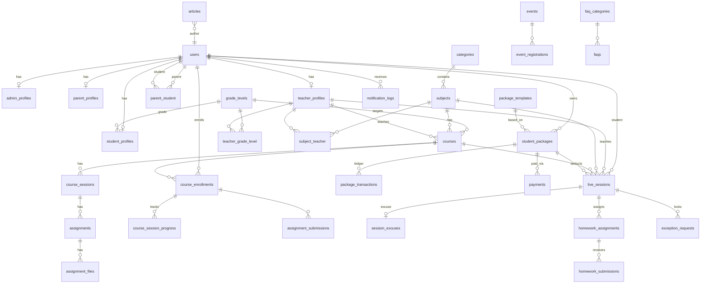

# Elite Academy — Full Database Design

> **Source:** Project Overview (MVP) + Public Website UI
> **Stack:** Laravel 13 · SQLite/MySQL/PostgreSQL · Normalized relational schema
> **Version:** 2.0

---

## 1. Design Principles

| Principle | Implementation |
|-----------|----------------|
| Single auth table | `users` table; profile tables per type (`student_profiles`, `teacher_profiles`, `parent_profiles`, `admin_profiles`) |
| No role enum | User type determined by which profile table has a record |
| Parent ↔ Student | One parent → many students; each student has own login |
| Privacy | Teacher personal contact hidden from students/parents |
| Session packages | Ledger-style `package_transactions` for every credit/debit |
| Live session link | Backend-controlled visibility (`link_visible_at = scheduled_at - 30 min`) |
| Session unlock | `course_session_progress.status` + assignment completion unlocks next session |
| Manual payments | No gateway in MVP; admin confirms → package activates |
| Translation `_()` | All translatable strings use Laravel `_()` helper — no `_ar` columns in DB |
| Category → Subject | `categories` table with FK on `subjects.category_id` |
| Course → Teacher | Direct `teacher_id` FK on `courses` (one teacher per course) |
| Soft deletes | Users, teachers, courses, subjects, articles, events |

---

## 2. User Types & Permissions

```
┌─────────┬──────────────────────────────────────────────────────────────┐
│ Type    │ Capabilities                                                 │
├─────────┼──────────────────────────────────────────────────────────────┤
│ admin   │ Full system: users, sessions, packages, payments, reports    │
│ teacher │ Own sessions, homework, attendance; no financial data          │
│ student │ Own sessions, homework, attendance, package balance (read)     │
│ parent  │ Read-only view of linked children; no edit attendance/payment │
└─────────┴──────────────────────────────────────────────────────────────┘
```

> **Note:** User type is determined by checking which profile table (`admin_profiles`, `teacher_profiles`, `student_profiles`, `parent_profiles`) has a record linked to the user.

### Account lifecycle (`users.status`)

| Value | Description |
|-------|-------------|
| `pending` | Registered, awaiting admin approval |
| `approved` | Active account |
| `rejected` | Registration denied |
| `suspended` | Temporarily disabled |

---

## 3. Entity Relationship Diagram



---

## 4. Table Definitions

### 4.1 Authentication & Users

#### `users` (extended)
| Column | Type | Notes |
|--------|------|-------|
| id | bigint PK | |
| name | varchar(255) | |
| email | varchar(255) UNIQUE | |
| phone | varchar(30) NULL | |
| password | varchar(255) | |
| status | enum | `pending`, `approved`, `rejected`, `suspended` |
| email_verified_at | timestamp NULL | |
| remember_token | varchar(100) NULL | |
| deleted_at | timestamp NULL | soft delete |
| created_at, updated_at | timestamps | |

**Indexes:** `status`, `phone`

---

#### `admin_profiles`
| Column | Type | Notes |
|--------|------|-------|
| id | bigint PK | |
| user_id | bigint FK → users UNIQUE | |
| created_at, updated_at | timestamps | |

---

#### `student_profiles`
| Column | Type | Notes |
|--------|------|-------|
| id | bigint PK | |
| user_id | bigint FK → users UNIQUE | |
| grade_level_id | bigint FK → grade_levels NULL | |
| school_name | varchar(255) NULL | |
| date_of_birth | date NULL | |
| avatar | varchar(255) NULL | |
| has_used_free_session | boolean | default false |
| created_at, updated_at | timestamps | |

---

#### `parent_profiles`
| Column | Type | Notes |
|--------|------|-------|
| id | bigint PK | |
| user_id | bigint FK → users UNIQUE | |
| created_at, updated_at | timestamps | |

---

#### `parent_student` (pivot)
| Column | Type | Notes |
|--------|------|-------|
| id | bigint PK | |
| parent_user_id | bigint FK → users | |
| student_user_id | bigint FK → users | |
| relationship | varchar(50) NULL | father, mother, guardian |
| is_primary | boolean | default true |
| created_at, updated_at | timestamps | |

**Unique:** `(parent_user_id, student_user_id)`

---

#### `teacher_profiles`
| Column | Type | Notes |
|--------|------|-------|
| id | bigint PK | |
| user_id | bigint FK → users UNIQUE | |
| slug | varchar(255) UNIQUE | public profile URL |
| photo | varchar(255) NULL | |
| title | varchar(255) NULL | e.g. "PhD MIT" |
| specialization | varchar(255) NULL | |
| bio | text NULL | |
| years_experience | smallint NULL | |
| rating_avg | decimal(3,2) | cached, default 0 |
| students_count | int | cached, default 0 |
| is_featured | boolean | homepage carousel |
| is_public | boolean | show on public site |
| show_contact_info | boolean | **always false** for student/parent view |
| deleted_at | timestamp NULL | |
| created_at, updated_at | timestamps | |

**Indexes:** `(is_featured, is_public)`

---

#### `account_status_logs`
Audit trail for approve/reject/suspend actions.

| Column | Type | Notes |
|--------|------|-------|
| id | bigint PK | |
| user_id | bigint FK → users | |
| from_status | varchar(20) NULL | |
| to_status | varchar(20) | |
| reason | text NULL | |
| changed_by | bigint FK → users NULL | admin |
| created_at | timestamp | |

---

### 4.2 Academic Structure

#### `grade_levels`
| Column | Type | Notes |
|--------|------|-------|
| id | bigint PK | |
| name | varchar(100) | translated via `_()` |
| slug | varchar(100) UNIQUE | |
| sort_order | smallint | |
| is_active | boolean | |
| created_at, updated_at | timestamps | |

---

#### `categories`
| Column | Type | Notes |
|--------|------|-------|
| id | bigint PK | |
| name | varchar(100) | translated via `_()` |
| slug | varchar(100) UNIQUE | |
| color_theme | varchar(30) NULL | UI badge color |
| sort_order | smallint | |
| is_active | boolean | |
| created_at, updated_at | timestamps | |

---

#### `subjects`
| Column | Type | Notes |
|--------|------|-------|
| id | bigint PK | |
| category_id | bigint FK → categories | |
| name | varchar(100) | translated via `_()` |
| slug | varchar(100) UNIQUE | |
| description | text NULL | |
| image | varchar(255) NULL | |
| sort_order | smallint | |
| is_active | boolean | |
| deleted_at | timestamp NULL | |
| created_at, updated_at | timestamps | |

**Indexes:** `(category_id, is_active)`

---

#### `subject_teacher` (M:N — multiple teachers per subject)
| Column | Type |
|--------|------|
| subject_id | FK → subjects |
| teacher_profile_id | FK → teacher_profiles |

**PK:** `(subject_id, teacher_profile_id)`

---

#### `teacher_grade_level` (grades teacher teaches)
| Column | Type |
|--------|------|
| teacher_profile_id | FK → teacher_profiles |
| grade_level_id | FK → grade_levels |

**PK:** `(teacher_profile_id, grade_level_id)`

---

#### `courses`
| Column | Type | Notes |
|--------|------|-------|
| id | bigint PK | |
| subject_id | bigint FK → subjects | |
| grade_level_id | bigint FK NULL | |
| teacher_id | bigint FK → teacher_profiles | **one teacher per course** |
| title | varchar(255) | translated via `_()` |
| slug | varchar(255) UNIQUE | |
| description | text NULL | |
| image | varchar(255) NULL | |
| sessions_count | smallint | default 0 |
| session_duration_minutes | smallint | default 60 |
| rating_avg | decimal(3,2) | default 0 |
| reviews_count | int | default 0 |
| enrollments_count | int | default 0 |
| has_free_demo | boolean | |
| is_accredited | boolean | |
| is_active | boolean | |
| deleted_at | timestamp NULL | |
| created_at, updated_at | timestamps | |

**Indexes:** `(subject_id, is_active)`, `teacher_id`

---

### 4.3 Course Content (Sessions & Assignments)

#### `course_sessions`
| Column | Type | Notes |
|--------|------|-------|
| id | bigint PK | |
| course_id | bigint FK → courses | |
| title | varchar(255) | |
| description | text NULL | |
| sort_order | smallint | controls session sequence |
| duration_minutes | smallint | default 0 |
| video_url | varchar(500) NULL | |
| content | text NULL | |
| is_free_demo | boolean | |
| created_at, updated_at | timestamps | |

**Indexes:** `(course_id, sort_order)`

---

#### `assignments`
| Column | Type | Notes |
|--------|------|-------|
| id | bigint PK | |
| course_session_id | bigint FK → course_sessions | linked to its session |
| title | varchar(255) | |
| description | text NULL | |
| sort_order | smallint | |
| due_at | datetime NULL | |
| status | enum | `draft`, `published`, `closed` |
| created_at, updated_at | timestamps | |

**Indexes:** `(course_session_id, sort_order)`

---

#### `assignment_files`
| Column | Type | Notes |
|--------|------|-------|
| id | bigint PK | |
| assignment_id | bigint FK → assignments | |
| uploaded_by_user_id | bigint FK → users | |
| file_path | varchar(500) | |
| file_name | varchar(255) | |
| mime_type | varchar(100) NULL | |
| file_size | int NULL | |
| created_at | timestamp | |

---

### 4.4 Session → Assignment → Unlock Flow

```
┌──────────────────────────────────────────────────────────────────────┐
│                    Session Unlock Flow                                │
│                                                                      │
│  Session 1 (sort_order=1)  ──→  unlocked by default (first session)  │
│       └── Assignment 1.1                                             │
│       └── Assignment 1.2                                             │
│            │                                                         │
│            ▼  (all assignments completed?)                           │
│                                                                      │
│  Session 2 (sort_order=2)  ──→  unlocked when Session 1 done        │
│       └── Assignment 2.1                                             │
│            │                                                         │
│            ▼  (all assignments completed?)                           │
│                                                                      │
│  Session 3 (sort_order=3)  ──→  unlocked when Session 2 done        │
│       └── ...                                                        │
└──────────────────────────────────────────────────────────────────────┘
```

#### `course_session_progress`
Tracks each student's progress per session. Controls the lock/unlock flow.

| Column | Type | Notes |
|--------|------|-------|
| id | bigint PK | |
| course_enrollment_id | bigint FK → course_enrollments | |
| course_session_id | bigint FK → course_sessions | |
| status | enum | `locked`, `unlocked`, `in_progress`, `completed` |
| unlocked_at | timestamp NULL | when session was unlocked |
| completed_at | timestamp NULL | when session was completed |
| created_at, updated_at | timestamps | |

**Unique:** `(course_enrollment_id, course_session_id)`
**Indexes:** `(course_enrollment_id, status)`

**Unlock rules:**
```php
// First session (sort_order = 1) → unlocked by default on enrollment
// For subsequent sessions:
// 1. Get all assignments for the current session
// 2. Check if all assignment_submissions for this student have status = 'completed'
// 3. If yes → update next session's course_session_progress.status = 'unlocked'
```

---

#### `assignment_submissions`
| Column | Type | Notes |
|--------|------|-------|
| id | bigint PK | |
| assignment_id | bigint FK → assignments | |
| student_user_id | bigint FK → users | |
| course_enrollment_id | bigint FK → course_enrollments | |
| submitted_at | timestamp NULL | |
| status | enum | `pending`, `submitted`, `completed`, `late` |
| grade | decimal(5,2) NULL | e.g. 98/100 |
| teacher_notes | text NULL | |
| reviewed_at | timestamp NULL | |
| reviewed_by | bigint FK → users NULL | |
| created_at, updated_at | timestamps | |

**Unique:** `(assignment_id, student_user_id)`
**Indexes:** `(student_user_id, status)`

---

#### `assignment_submission_files`
| Column | Type | Notes |
|--------|------|-------|
| id | bigint PK | |
| assignment_submission_id | bigint FK → assignment_submissions | |
| file_path | varchar(500) | |
| file_name | varchar(255) | |
| mime_type | varchar(100) NULL | |
| file_size | int NULL | |
| created_at | timestamp | |

---

### 4.5 Course Enrollment & Progress

#### `course_enrollments`
| Column | Type | Notes |
|--------|------|-------|
| id | bigint PK | |
| student_user_id | bigint FK → users | |
| course_id | bigint FK → courses | |
| cohort | varchar(100) NULL | e.g. "Fall 2026" |
| status | enum | `active`, `completed`, `dropped` |
| progress_percent | tinyint | 0–100 |
| enrolled_at | timestamp | |
| completed_at | timestamp NULL | |
| created_at, updated_at | timestamps | |

**Unique:** `(student_user_id, course_id, cohort)`
**Indexes:** `(student_user_id, status)`

---

#### `achievements`
| Column | Type |
|--------|------|
| id | bigint PK |
| name | varchar(255) |
| description | text NULL |
| icon | varchar(50) NULL |
| type | enum: `badge`, `certificate`, `honor_roll` |
| created_at, updated_at | timestamps |

---

#### `student_achievements`
| Column | Type |
|--------|------|
| id | bigint PK |
| student_user_id | FK → users |
| achievement_id | FK → achievements |
| metadata | json NULL |
| earned_at | timestamp |

**Unique:** `(student_user_id, achievement_id)`

---

#### `certificates`
| Column | Type |
|--------|------|
| id | bigint PK |
| student_user_id | FK → users |
| course_id | FK NULL |
| certificate_number | varchar(50) UNIQUE |
| title | varchar(255) |
| issued_at | timestamp |
| verified_at | timestamp NULL |
| created_at, updated_at | timestamps |

---

#### `course_reviews`
| Column | Type |
|--------|------|
| id | bigint PK |
| course_id | FK → courses |
| student_user_id | FK → users |
| rating | tinyint (1–5) |
| comment | text NULL |
| is_verified | boolean |
| created_at | timestamp |

**Unique:** `(course_id, student_user_id)`

---

### 4.6 Packages & Payments

#### `package_templates`
Admin-defined package types (e.g. "8 Sessions Package").

| Column | Type |
|--------|------|
| id | bigint PK |
| name | varchar(255) |
| sessions_count | smallint |
| price | decimal(10,2) |
| description | text NULL |
| is_active | boolean |
| created_at, updated_at | timestamps |

---

#### `student_packages`
Active balance per student (optionally per course).

| Column | Type | Notes |
|--------|------|-------|
| id | bigint PK | |
| student_user_id | bigint FK → users | |
| course_id | bigint FK NULL | optional scope |
| package_template_id | bigint FK NULL | |
| total_sessions | smallint | e.g. 8 |
| used_sessions | smallint | default 0 |
| remaining_sessions | smallint | **maintained by ledger** |
| status | enum | `pending`, `active`, `exhausted`, `suspended` |
| activated_at | timestamp NULL | |
| expires_at | timestamp NULL | |
| created_at, updated_at | timestamps | |

**Indexes:** `(student_user_id, status)`

---

#### `package_transactions` (ledger)
Every session deduct/refund MUST have a record.

| Column | Type | Notes |
|--------|------|-------|
| id | bigint PK | |
| student_package_id | bigint FK | |
| live_session_id | bigint FK NULL | |
| type | enum | see below |
| sessions_delta | smallint | negative = deduct, positive = refund |
| balance_before | smallint | |
| balance_after | smallint | |
| reason | varchar(255) NULL | |
| performed_by | bigint FK → users NULL | admin/system |
| created_at | timestamp | |

**`type` values:** `free_session`, `session_deduct`, `session_refund`, `teacher_cancel_refund`, `manual_add`, `manual_adjust`, `payment_activation`

**Indexes:** `(student_package_id, created_at)`

---

#### `payments`
Manual payment records confirmed by admin.

| Column | Type | Notes |
|--------|------|-------|
| id | bigint PK | |
| student_user_id | bigint FK → users | |
| parent_user_id | bigint FK NULL | |
| student_package_id | bigint FK NULL | |
| amount | decimal(10,2) | |
| sessions_count | smallint | |
| payment_method | varchar(50) | cash, bank_transfer, etc. |
| payment_date | date | |
| status | enum | `pending`, `confirmed`, `rejected` |
| notes | text NULL | |
| confirmed_by | bigint FK → users NULL | |
| confirmed_at | timestamp NULL | |
| created_at, updated_at | timestamps | |

**Indexes:** `(status, payment_date)`, `student_user_id`

---

### 4.7 Live Sessions

> Table name: **`live_sessions`** (avoids conflict with Laravel `sessions`)

#### `live_sessions`
| Column | Type | Notes |
|--------|------|-------|
| id | bigint PK | |
| student_user_id | bigint FK → users | |
| teacher_profile_id | bigint FK | |
| subject_id | bigint FK | |
| course_id | bigint FK NULL | |
| student_package_id | bigint FK NULL | |
| scheduled_at | datetime | |
| duration_minutes | smallint | default 60 |
| meeting_link | varchar(500) NULL | Google Meet / Zoom |
| meeting_platform | enum | `google_meet`, `zoom`, `other` |
| status | enum | see lifecycle below |
| attendance_status | enum NULL | `present`, `absent`, `excused` |
| link_visible_at | datetime NULL | = scheduled_at − 30 min |
| is_free_session | boolean | first free session |
| is_deducted_from_package | boolean | |
| is_locked | boolean | homework lock |
| lock_reason | varchar(255) NULL | |
| cancelled_at | datetime NULL | |
| cancelled_by | bigint FK → users NULL | |
| cancellation_reason | text NULL | |
| rescheduled_from_id | bigint FK → live_sessions NULL | |
| original_scheduled_at | datetime NULL | |
| reminder_sent_at | datetime NULL | 2 hours before |
| created_at, updated_at | timestamps | |

**Session `status` lifecycle:**
```
scheduled → link_visible → in_progress → completed
         ↘ cancelled_by_teacher
         ↘ rescheduled (new row linked via rescheduled_from_id)
```

**Package deduction rules:**

| attendance_status | Deduct from package? |
|-------------------|---------------------|
| present | ✅ Yes |
| absent | ✅ Yes |
| excused | ❌ No |
| cancelled_by_teacher | ❌ No (+ refund if already deducted) |
| rescheduled | ❌ No extra deduct |

**Indexes:** `(student_user_id, scheduled_at)`, `(teacher_profile_id, scheduled_at)`, `(status, scheduled_at)`

---

#### `session_excuses`
| Column | Type | Notes |
|--------|------|-------|
| id | bigint PK | |
| live_session_id | bigint FK UNIQUE | |
| student_user_id | bigint FK → users | |
| reason | text NULL | |
| excused_at | timestamp | |
| is_within_deadline | boolean | ≥ 2 hours before session |
| created_at | timestamp | |

**Business rule:** Excuse allowed until 2 hours before `scheduled_at`.

---

### 4.8 Homework (Live Session context)

#### `homework_assignments`
| Column | Type | Notes |
|--------|------|-------|
| id | bigint PK | |
| live_session_id | bigint FK NULL | |
| teacher_profile_id | bigint FK | |
| course_id | bigint FK NULL | |
| title | varchar(255) | |
| description | text NULL | |
| due_at | datetime | |
| status | enum | `draft`, `published`, `closed` |
| created_at, updated_at | timestamps | |

**Indexes:** `(teacher_profile_id, due_at)`

---

#### `homework_submissions`
| Column | Type | Notes |
|--------|------|-------|
| id | bigint PK | |
| homework_assignment_id | FK | |
| student_user_id | FK → users | |
| submitted_at | timestamp NULL | |
| status | enum | `pending`, `submitted`, `late`, `reviewed` |
| grade | decimal(5,2) NULL | |
| teacher_notes | text NULL | |
| reviewed_at | timestamp NULL | |
| reviewed_by | bigint FK NULL | |
| created_at, updated_at | timestamps | |

**Unique:** `(homework_assignment_id, student_user_id)`
**Indexes:** `(student_user_id, status)`

**Lock rule:** If previous homework is unsubmitted → next `live_session.is_locked = true`.

---

#### `homework_files`
| Column | Type |
|--------|------|
| id | bigint PK |
| homework_assignment_id | FK NULL |
| homework_submission_id | FK NULL |
| uploaded_by_user_id | FK → users |
| file_path | varchar(500) |
| file_name | varchar(255) |
| mime_type | varchar(100) NULL |
| file_size | int NULL |
| created_at | timestamp |

---

### 4.9 Exception Requests

#### `exception_requests`
| Column | Type | Notes |
|--------|------|-------|
| id | bigint PK | |
| student_user_id | bigint FK → users | |
| live_session_id | bigint FK | session to unlock |
| homework_assignment_id | bigint FK NULL | |
| reason | text | |
| attachment_path | varchar(500) NULL | |
| status | enum | `pending`, `approved`, `rejected` |
| reviewed_by | bigint FK → users NULL | admin |
| reviewed_at | timestamp NULL | |
| admin_notes | text NULL | |
| created_at, updated_at | timestamps | |

**Indexes:** `(status, created_at)`, `student_user_id`

---

### 4.10 Notifications

Uses Laravel's built-in `notifications` table (UUID).

#### `notification_logs` (audit)
| Column | Type |
|--------|------|
| id | bigint PK |
| user_id | FK → users |
| type | varchar(100) |
| channel | enum: `database`, `mail`, `sms` |
| payload | json |
| sent_at | timestamp |

**Indexes:** `(user_id, sent_at)`

**Notification triggers:**
- Account approved/rejected
- Session reminder (2h before)
- Session link opened (30 min before)
- Homework assigned / overdue
- Session locked / exception approved/rejected
- Session cancelled / rescheduled
- Package activated

---

### 4.11 Public Website / CMS

#### `site_settings`
| Column | Type | Notes |
|--------|------|-------|
| id | bigint PK | |
| group | varchar(50) | `general`, `stats`, `contact`, `social` |
| key | varchar(100) UNIQUE | |
| value | text NULL | translated via `_()` where needed |
| created_at, updated_at | timestamps | |

---

#### `hero_slides`
| Column | Type |
|--------|------|
| id | bigint PK |
| title | varchar(255) |
| subtitle | text NULL |
| image | varchar(255) |
| track_label | varchar(100) NULL |
| cta_primary_url | varchar(255) NULL |
| cta_secondary_url | varchar(255) NULL |
| sort_order | smallint |
| is_active | boolean |
| created_at, updated_at | timestamps |

---

#### `why_choose_features`
| Column | Type |
|--------|------|
| id | bigint PK |
| icon | varchar(20) NULL |
| title | varchar(255) |
| description | text NULL |
| sort_order | smallint |
| created_at, updated_at | timestamps |

---

#### `about_sections`
| Column | Type |
|--------|------|
| id | bigint PK |
| section_key | varchar(50) UNIQUE |
| title | varchar(255) |
| content | text |
| image | varchar(255) NULL |
| created_at, updated_at | timestamps |

---

#### `testimonials`
| Column | Type |
|--------|------|
| id | bigint PK |
| name | varchar(255) |
| avatar | varchar(255) NULL |
| content | text |
| course_name | varchar(255) NULL |
| rating | tinyint |
| reviewer_type | enum: `student`, `parent` |
| is_verified | boolean |
| is_featured | boolean |
| sort_order | smallint |
| created_at, updated_at | timestamps |

---

#### `faq_categories`
| Column | Type |
|--------|------|
| id | bigint PK |
| name | varchar(255) |
| sort_order | smallint |
| created_at, updated_at | timestamps |

---

#### `faqs`
| Column | Type |
|--------|------|
| id | bigint PK |
| faq_category_id | FK |
| question | text |
| answer | text |
| sort_order | smallint |
| is_active | boolean |
| created_at, updated_at | timestamps |

---

#### `articles` (blog)
| Column | Type |
|--------|------|
| id | bigint PK |
| author_user_id | bigint FK NULL |
| title | varchar(255) |
| slug | varchar(255) UNIQUE |
| excerpt | text NULL |
| content | longtext |
| image | varchar(255) NULL |
| category | varchar(100) |
| read_time_minutes | smallint |
| published_at | timestamp NULL |
| is_published | boolean |
| deleted_at | timestamp NULL |
| created_at, updated_at | timestamps |

**Indexes:** `(is_published, published_at)`

---

### 4.12 Events & Contact

#### `events`
| Column | Type |
|--------|------|
| id | bigint PK |
| title | varchar(255) |
| slug | varchar(255) UNIQUE |
| description | text |
| image | varchar(255) NULL |
| event_type | varchar(50) |
| starts_at | datetime |
| ends_at | datetime NULL |
| location | varchar(255) NULL |
| is_online | boolean |
| capacity | smallint NULL |
| seats_remaining | smallint NULL |
| registration_fee | decimal(10,2) |
| is_free | boolean |
| is_published | boolean |
| deleted_at | timestamp NULL |
| created_at, updated_at | timestamps |

**Indexes:** `(is_published, starts_at)`

---

#### `event_agenda_items`
| Column | Type |
|--------|------|
| id | bigint PK |
| event_id | FK |
| starts_at | time |
| title | varchar(255) |
| description | text NULL |
| sort_order | smallint |
| created_at, updated_at | timestamps |

---

#### `event_speakers`
| Column | Type |
|--------|------|
| event_id | FK → events |
| teacher_profile_id | FK → teacher_profiles |

**PK:** `(event_id, teacher_profile_id)`

---

#### `event_registrations`
| Column | Type |
|--------|------|
| id | bigint PK |
| event_id | FK |
| user_id | FK NULL |
| full_name | varchar(255) |
| email | varchar(255) |
| attendance_mode | enum: `in_person`, `online` |
| status | enum: `pending`, `confirmed`, `cancelled` |
| created_at | timestamp |

**Indexes:** `(event_id, status)`

---

#### `contact_messages`
| Column | Type |
|--------|------|
| id | bigint PK |
| full_name | varchar(255) |
| email | varchar(255) |
| phone | varchar(30) NULL |
| subject | varchar(255) NULL |
| message | text |
| status | enum: `new`, `read`, `replied`, `archived` |
| replied_at | timestamp NULL |
| created_at, updated_at | timestamps |

**Indexes:** `(status, created_at)`

---

## 5. Key Business Rules (Backend Enforcement)

### 5.1 Session Unlock Flow (Course Sessions)
```php
// When a student enrolls → create course_session_progress for all sessions
// First session (sort_order = 1) → status = 'unlocked'
// All others → status = 'locked'

// When student completes all assignments for a session:
$currentSession = CourseSession::find($sessionId);
$nextSession = CourseSession::where('course_id', $currentSession->course_id)
    ->where('sort_order', '>', $currentSession->sort_order)
    ->orderBy('sort_order')
    ->first();

if ($nextSession) {
    $progress = CourseSessionProgress::where('course_enrollment_id', $enrollmentId)
        ->where('course_session_id', $nextSession->id)
        ->first();
    $progress->update(['status' => 'unlocked', 'unlocked_at' => now()]);
}
```

### 5.2 Live session link visibility
```php
// Link visible when: now() >= scheduled_at - 30 minutes AND status IN (scheduled, link_visible, in_progress)
$session->link_visible_at = $session->scheduled_at->subMinutes(30);
```

### 5.3 Session reminder
Scheduled job at `scheduled_at - 2 hours` → notify student + linked parents.

### 5.4 Excuse deadline
```php
$deadline = $session->scheduled_at->subHours(2);
$canExcuse = now() <= $deadline;
// If excused in time → attendance_status = excused, no package deduct
// If no-show → attendance_status = absent, deduct package
```

### 5.5 First free session
```php
if (!$studentProfile->has_used_free_session) {
    $session->is_free_session = true;
    // No package deduct; mark has_used_free_session = true after completion
}
```

### 5.6 Homework lock (Live Sessions)
Before session starts, check if student has overdue unsubmitted homework for same course/teacher → set `is_locked = true`.

### 5.7 Parent data isolation
```sql
-- Parent queries MUST filter:
WHERE student_user_id IN (SELECT student_user_id FROM parent_student WHERE parent_user_id = :parent_id)
```

### 5.8 Translation approach
```php
// All user-facing strings use Laravel's _() helper
// Example in Blade templates:
{{ _('Mathematics') }}
{{ _('Session completed successfully') }}

// No _ar columns in database — translations stored in lang/ files
// resources/lang/ar.json for Arabic translations
// resources/lang/en.json for English translations
```

---

## 6. Indexes Summary

| Table | Index |
|-------|-------|
| users | `status`, `email`, `phone` |
| parent_student | `(parent_user_id)`, `(student_user_id)` |
| teacher_profiles | `(is_featured, is_public)` |
| categories | `slug` |
| subjects | `(category_id, is_active)` |
| courses | `(subject_id, is_active)`, `teacher_id` |
| course_sessions | `(course_id, sort_order)` |
| assignments | `(course_session_id, sort_order)` |
| course_session_progress | `(course_enrollment_id, status)` |
| live_sessions | `(student_user_id, scheduled_at)`, `(teacher_profile_id, scheduled_at)`, `(status, scheduled_at)` |
| student_packages | `(student_user_id, status)` |
| package_transactions | `(student_package_id, created_at)` |
| assignment_submissions | `(student_user_id, status)` |
| homework_submissions | `(student_user_id, status)` |
| articles, events | `slug`, `published_at` |

---

## 7. Migration Order

```
1.  create_users_table (Laravel default)
2.  extend_users_table (add phone, status, soft deletes)
3.  create_grade_levels_table
4.  create_profiles_and_parent_student_tables
5.  create_subjects_and_courses_tables (categories, subjects, subject_teacher, teacher_grade_level, courses)
6.  create_course_content_tables (course_sessions, assignments, assignment_files)
7.  create_enrollments_and_progress_tables (enrollments, session_progress, assignment_submissions, achievements, certificates, reviews)
8.  create_package_and_payment_tables
9.  create_live_sessions_table (live_sessions, session_excuses)
10. create_homework_and_exceptions_tables
11. create_cms_tables
12. create_events_and_contact_tables
```

---

## 8. Requirements Coverage Checklist

| # | Requirement | Tables |
|---|-------------|--------|
| 1 | 4 user types + registration approval | `users`, `*_profiles`, `account_status_logs` |
| 2 | Parent → many students | `parent_student`, `parent_profiles`, `student_profiles` |
| 3 | Student dashboard data | `live_sessions`, `homework_*`, `student_packages`, `notification_logs` |
| 4 | Parent read-only dashboard | `parent_student` + same tables (scoped) |
| 5 | Teacher dashboard | `live_sessions`, `homework_*`, `teacher_profiles` |
| 6 | Categories, subjects, courses | `categories`, `subjects`, `courses`, `subject_teacher`, `teacher_*` |
| 7 | Live sessions + link timing | `live_sessions.link_visible_at` |
| 8 | 2-hour reminder | `live_sessions.reminder_sent_at` + notifications |
| 9 | Excuse rules | `session_excuses`, `attendance_status` |
| 10 | Teacher cancel/reschedule | `live_sessions.status`, `package_transactions` |
| 11 | Session packages + ledger | `student_packages`, `package_transactions` |
| 12 | Free first session + manual payment | `student_profiles.has_used_free_session`, `payments` |
| 13 | Course sessions + assignments | `course_sessions`, `assignments`, `assignment_submissions` |
| 14 | Session unlock on assignment completion | `course_session_progress.status` |
| 15 | Homework (live sessions) | `homework_assignments`, `homework_submissions`, `homework_files` |
| 16 | Session lock for homework | `live_sessions.is_locked` |
| 17 | Exception requests | `exception_requests` |
| 18 | Attendance + deduction rules | `live_sessions.attendance_status`, `is_deducted_from_package` |
| 19 | Notifications | Laravel `notifications` + `notification_logs` |
| 20–24 | Admin management | All tables + status/audit fields |
| 25 | Reports | Query views on existing tables |
| 26 | Public website | CMS tables + `articles`, `events`, `faqs`, `testimonials` |
| 27 | Hide teacher contact | `teacher_profiles.show_contact_info`, API layer |

---

## 9. Next Steps

1. Run migrations: `php artisan migrate:fresh`
2. Seed grade levels, categories, subjects, package templates
3. Implement Eloquent models with relationships
4. Add database seeders for demo CMS content
5. Implement policies (Gates) per user type

---

## 10. شرح كامل لتصميم قاعدة البيانات بالعربي

### 📌 نظرة عامة

النظام مبني على Laravel ويستخدم قاعدة بيانات علائقية (relational database). الهدف هو إدارة أكاديمية تعليمية إلكترونية تدعم أربعة أنواع من المستخدمين: **مدير، مدرس، طالب، ولي أمر**.

---

### 🔐 المستخدمون والحسابات

#### جدول `users` — المستخدمون
- الجدول الأساسي لكل مستخدم في النظام
- يحتوي على: الاسم، الإيميل، رقم الهاتف، كلمة المرور
- حالة الحساب (`status`): معلّق، مقبول، مرفوض، موقوف
- **لا يوجد عمود role** — نوع المستخدم يُحدد من جدول الملف الشخصي المرتبط

#### جداول الملفات الشخصية — `admin_profiles`, `student_profiles`, `parent_profiles`, `teacher_profiles`
- كل نوع مستخدم له جدول ملف شخصي منفصل مرتبط بـ `users`
- **ملف الطالب** يحتوي على: المرحلة الدراسية، اسم المدرسة، تاريخ الميلاد، الصورة الشخصية، هل استخدم الحصة المجانية الأولى
- **ملف المدرس** يحتوي على: الصورة، اللقب، التخصص، النبذة، سنوات الخبرة، التقييم، عدد الطلاب، هل مميّز، هل عام

#### جدول `parent_student` — ربط ولي الأمر بالطالب
- يربط ولي أمر واحد بعدة طلاب
- يحدد نوع العلاقة (أب، أم، وصي)

#### جدول `account_status_logs` — سجل حالات الحساب
- يحتفظ بتاريخ كل تغيير في حالة الحساب (مقبول، مرفوض، إلخ)
- يسجل من قام بالتغيير والسبب

---

### 📚 الهيكل الأكاديمي

#### جدول `grade_levels` — المراحل الدراسية
- يحتوي على المراحل الدراسية (مثل: الصف الأول ثانوي)
- يُستخدم لتصنيف الطلاب والكورسات

#### جدول `categories` — التصنيفات
- تصنيفات عامة للمواد (مثل: تكنولوجيا، علوم، أعمال)
- كل تصنيف له اسم، slug، لون
- **العلاقة:** كل تصنيف يحتوي على عدة مواد

#### جدول `subjects` — المواد الدراسية
- كل مادة تنتمي لتصنيف واحد (`category_id` FK)
- تحتوي على: الاسم، الوصف، الصورة
- **العلاقة:** كل مادة تحتوي على عدة كورسات

#### جدول `subject_teacher` — ربط المادة بالمدرس
- جدول وسيط (pivot) لربط المواد بالمدرسين
- مدرس واحد يمكنه تدريس عدة مواد، والمادة يمكن أن يدرسها عدة مدرسين

#### جدول `teacher_grade_level` — المراحل التي يدرسها المدرس
- يربط المدرس بالمراحل الدراسية التي يدرسها

#### جدول `courses` — الكورسات
- كل كورس ينتمي لمادة واحدة ومرتبط بمدرس واحد
- يحتوي على: العنوان، الوصف، الصورة، عدد الحصص، مدة الحصة
- **لا يوجد سعر أو عملة** — الأسعار في جدول الباقات (`package_templates`)
- **مدرس واحد فقط** لكل كورس (بدون جدول وسيط)

---

### 📖 محتوى الكورس (الحصص والتكليفات)

#### جدول `course_sessions` — حصص الكورس
- كل كورس يحتوي على **عدة حصص** (sessions)
- كل حصة لها: عنوان، وصف، ترتيب (`sort_order`)، مدة، رابط فيديو، محتوى
- الترتيب (`sort_order`) يحدد تسلسل الحصص

#### جدول `assignments` — التكليفات
- كل حصة لها **تكليف واحد أو أكثر**
- التكليف مرتبط بالحصة عبر `course_session_id`
- يحتوي على: العنوان، الوصف، تاريخ التسليم، الحالة

#### ⭐ نظام فتح الحصص (Session Unlock Flow)

```
الكورس
  └── حصة 1 (مفتوحة تلقائياً عند التسجيل)
  │     └── تكليف 1.1
  │     └── تكليف 1.2
  │          ↓ (عند إكمال جميع التكليفات)
  │
  └── حصة 2 (تُفتح بعد إكمال تكليفات حصة 1)
  │     └── تكليف 2.1
  │          ↓ (عند إكمال جميع التكليفات)
  │
  └── حصة 3 (تُفتح بعد إكمال تكليفات حصة 2)
        └── ...
```

**القاعدة:**
1. عند تسجيل الطالب في الكورس → يتم إنشاء سجل `course_session_progress` لكل حصة
2. الحصة الأولى (`sort_order = 1`) → حالتها `unlocked` (مفتوحة)
3. باقي الحصص → حالتها `locked` (مقفلة)
4. عندما يُكمل الطالب **جميع تكليفات** الحصة الحالية → تُفتح الحصة التالية تلقائياً

#### جدول `course_session_progress` — تقدم الطالب في الحصص
- يتتبع حالة كل حصة لكل طالب
- الحالات: `locked` (مقفلة)، `unlocked` (مفتوحة)، `in_progress` (جارية)، `completed` (مكتملة)

#### جدول `assignment_submissions` — تسليمات التكليفات
- يسجل تسليم كل طالب لكل تكليف
- الحالات: `pending` (معلّق)، `submitted` (مُسلّم)، `completed` (مكتمل)، `late` (متأخر)
- عند تغيير الحالة إلى `completed` → يتم فحص إذا كانت جميع تكليفات الحصة مكتملة → فتح الحصة التالية

---

### 📝 التسجيل والتقدم

#### جدول `course_enrollments` — تسجيل الطلاب في الكورسات
- يسجل اشتراك كل طالب في كل كورس
- يحتوي على: الحالة (نشط، مكتمل، منسحب)، نسبة التقدم

#### جدول `achievements` — الإنجازات
- شارات، شهادات، لوحة شرف

#### جدول `student_achievements` — إنجازات الطلاب
- يربط الطالب بالإنجازات التي حصل عليها

#### جدول `certificates` — الشهادات
- شهادة إتمام الكورس برقم فريد

#### جدول `course_reviews` — تقييمات الكورسات
- تقييم من 1 إلى 5 مع تعليق

---

### 💰 الباقات والمدفوعات

#### جدول `package_templates` — قوالب الباقات
- الباقات المتاحة التي يحددها المدير (مثل: "باقة 8 حصص")
- تحتوي على: الاسم، عدد الحصص، السعر

#### جدول `student_packages` — باقات الطلاب
- الباقة الفعلية لكل طالب
- تتتبع: عدد الحصص الكلي، المستخدم، المتبقي
- الحالات: معلّقة، نشطة، منتهية، موقوفة

#### جدول `package_transactions` — سجل المعاملات (Ledger)
- **كل عملية خصم أو استرداد** يجب أن يكون لها سجل
- يحتوي على: نوع العملية، الفرق، الرصيد قبل وبعد

#### جدول `payments` — المدفوعات
- مدفوعات يدوية يؤكدها المدير
- تحتوي على: المبلغ، طريقة الدفع، تاريخ الدفع، الحالة

---

### 🎥 الحصص المباشرة (Live Sessions)

#### جدول `live_sessions` — الحصص المباشرة
- حصص فردية عبر الإنترنت (Google Meet / Zoom)
- تحتوي على: الطالب، المدرس، المادة، الموعد، رابط الاجتماع
- **نظام رؤية الرابط:** الرابط يظهر قبل الحصة بـ 30 دقيقة فقط
- **نظام القفل:** إذا لم يُسلّم الطالب الواجب → الحصة التالية مقفلة
- **نظام الخصم:** الحضور والغياب يُخصم من الباقة، الاعتذار لا يُخصم

#### جدول `session_excuses` — اعتذارات الحصص
- الطالب يمكنه الاعتذار قبل الحصة بساعتين على الأقل
- إذا اعتذر في الوقت → لا يُخصم من الباقة

---

### 📋 الواجبات (سياق الحصص المباشرة)

#### جدول `homework_assignments` — الواجبات المنزلية
- واجبات يُنشئها المدرس مرتبطة بالحصص المباشرة
- تختلف عن `assignments` التي ترتبط بحصص الكورس

#### جدول `homework_submissions` — تسليمات الواجبات

#### جدول `homework_files` — ملفات الواجبات

---

### 🔓 طلبات الاستثناء

#### جدول `exception_requests` — طلبات الاستثناء
- عندما تكون حصة الطالب المباشرة مقفلة بسبب واجب لم يُسلّم
- الطالب يقدم طلب استثناء مع السبب
- المدير يوافق أو يرفض

---

### 🔔 الإشعارات

#### جدول `notification_logs` — سجل الإشعارات
- يحتفظ بتاريخ كل إشعار تم إرساله
- القنوات: قاعدة البيانات، البريد الإلكتروني، SMS

---

### 🌐 الموقع العام (CMS)

#### `site_settings` — إعدادات الموقع
- إعدادات عامة مثل: عدد الطلاب، عدد الكورسات، رقم واتساب المالك

#### `hero_slides` — شرائح الصفحة الرئيسية

#### `why_choose_features` — مميزات "لماذا تختارنا"

#### `about_sections` — أقسام صفحة "من نحن"

#### `testimonials` — آراء العملاء

#### `faq_categories` و `faqs` — الأسئلة الشائعة

#### `articles` — المقالات (المدونة)

#### `events` — الفعاليات
- ورش عمل، مراجعات، ندوات إلكترونية

#### `event_agenda_items` — جدول أعمال الفعالية

#### `event_speakers` — متحدثو الفعالية

#### `event_registrations` — تسجيلات الفعاليات

#### `contact_messages` — رسائل التواصل

---

### 🌍 الترجمة

النظام **لا يستخدم أعمدة `_ar`** في قاعدة البيانات. بدلاً من ذلك:

```php
// في ملفات Blade:
{{ _('Mathematics') }}
{{ _('Your session has been scheduled') }}

// ملفات الترجمة:
// resources/lang/ar.json
{
    "Mathematics": "رياضيات",
    "Your session has been scheduled": "تم جدولة حصتك"
}
```

هذا الأسلوب يجعل:
- قاعدة البيانات أنظف وأبسط
- إضافة لغات جديدة أسهل (بدون تعديل على الجداول)
- إدارة الترجمة مركزية في ملفات `lang/`
